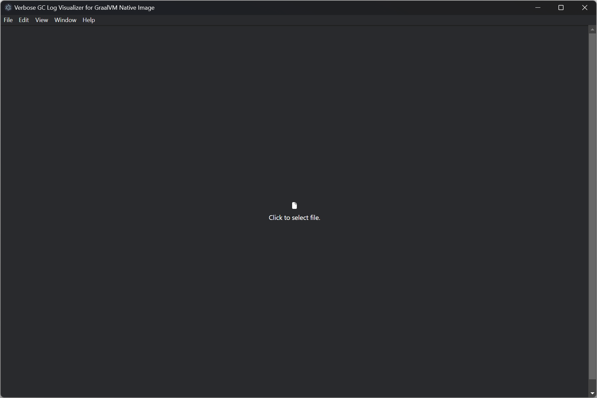
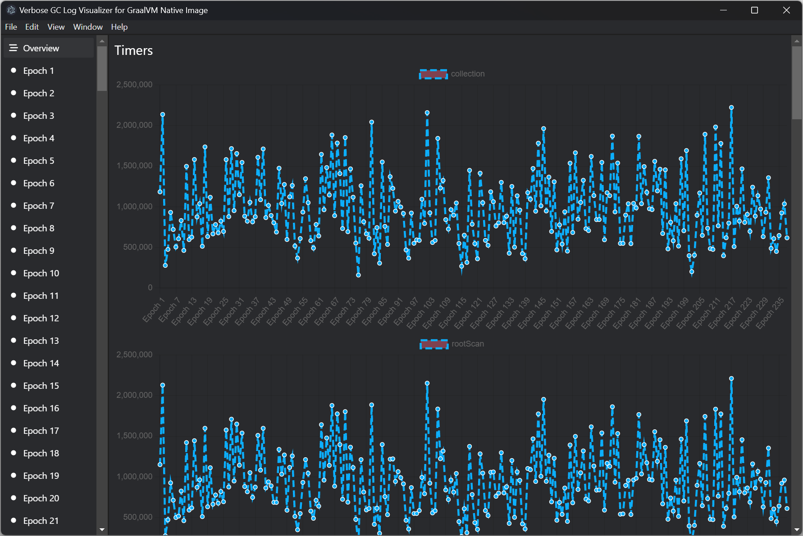
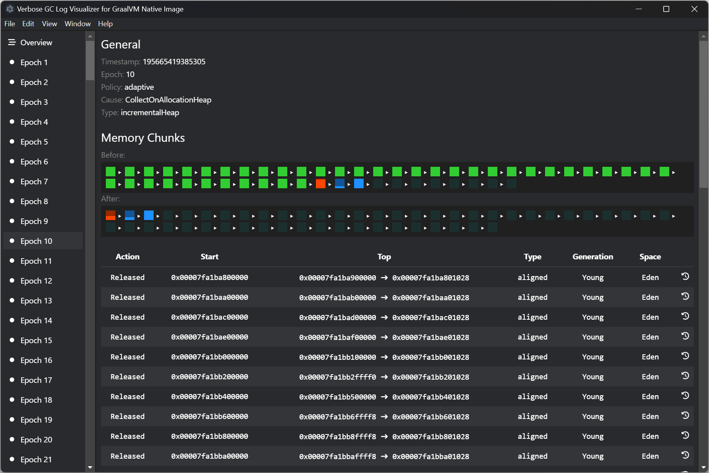
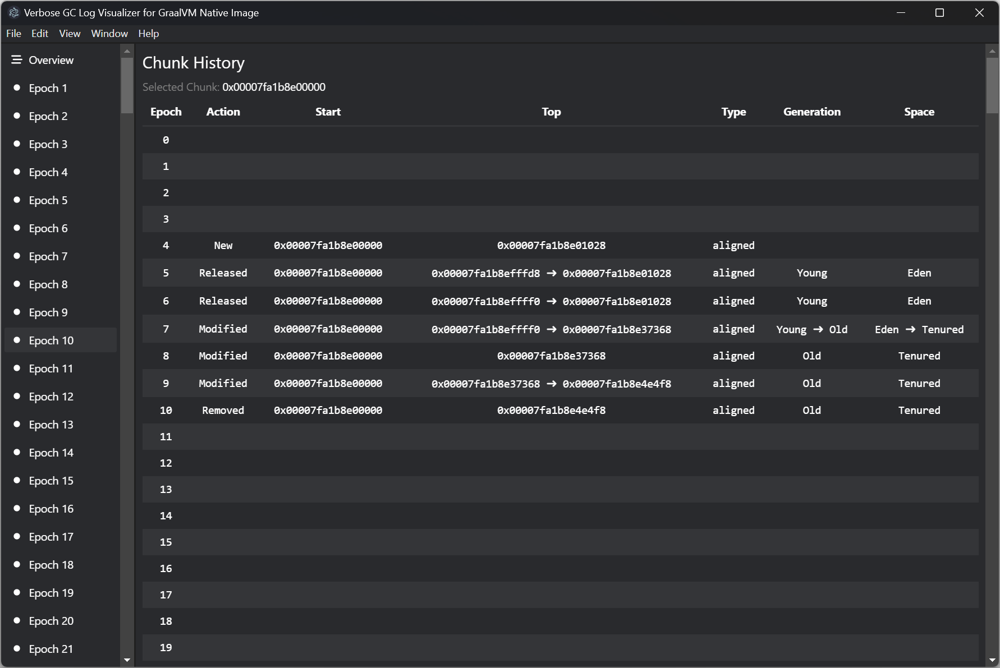

_Project in Software Engineering (339.018) - Johannes Kepler Universität Linz_

# Verbose GC Log Visualizer for GraalVM Native Image

When executing a native image, the options `-XX:+VerboseGC -XX:+PrintGCTimes -XX:+TraceHeapChunks -XX:+PrintHeapShape`
can be used to print detailed information on garbage collection.

The goal of this Project is to graphically visualize and digest the verbose output and, ultimately,
make it easier to understand for users.

- GC timers are shown in charts
- Chunk assignment to generations (young, old) and spaces (eden, survivor, tenured)
- Chunk tracing (changes to top pointer and affiliation over time)

**Example log entry:**

```
[[195665366158579 GC: before  epoch: 8  cause: CollectOnAllocationHeap:
  Young generation: 
    Eden: 
      edenSpace:
        aligned: 46137344/44 unaligned: 0/0
        aligned chunks:
          0x00007fa1ba200000 (0x00007fa1ba201028-0x00007fa1ba2fffd8)
          0x00007fa1ba400000 (0x00007fa1ba401028-0x00007fa1ba4ffff0)
          0x00007fa1ba600000 (0x00007fa1ba601028-0x00007fa1ba6ffff8)
          [...]
          0x00007fa1b8e00000 (0x00007fa1b8e01028-0x00007fa1b8effff0)
    Survivors: 
      Survivor-1 From:
        aligned: 1048576/1 unaligned: 0/0
        aligned chunks:
          0x00007fa1b9a00000 (0x00007fa1b9a01028-0x00007fa1b9a5c840)
      Survivor-1 To:
        aligned: 0/0 unaligned: 0/0
      Survivor-2 From:
        aligned: 1048576/1 unaligned: 0/0
        aligned chunks:
          0x00007fa1b9e00000 (0x00007fa1b9e01028-0x00007fa1b9e20e28)
      Survivor-2 To:
        aligned: 0/0 unaligned: 0/0
      Survivor-3 From:
        aligned: 0/0 unaligned: 0/0
      Survivor-3 To:
        aligned: 0/0 unaligned: 0/0
      [...]
      Survivor-15 From:
        aligned: 0/0 unaligned: 0/0
      Survivor-15 To:
        aligned: 0/0 unaligned: 0/0
  Old generation: 
    oldFromSpace:
      aligned: 1048576/1 unaligned: 131088/1
      aligned chunks:
        0x00007fa1b9400000 (0x00007fa1b9401028-0x00007fa1b9469858)
      unaligned chunks:
        0x00007fa1c4973000 (0x00007fa1c4973030-0x00007fa1c4993040)
    oldToSpace:
      aligned: 0/0 unaligned: 0/0
    
  Unused:
    aligned: 6291456/6
    aligned chunks:
      0x00007fa1ba000000 (0x00007fa1ba001028-0x00007fa1ba001028)
      0x00007fa1b9c00000 (0x00007fa1b9c01028-0x00007fa1b9c01028)
      0x00007fa1b9800000 (0x00007fa1b9801028-0x00007fa1b9801028)
      [...]
      0x00007fa1b9200000 (0x00007fa1b9201028-0x00007fa1b9201028)
]
 [195665368610984 GC: after   epoch: 8  cause: CollectOnAllocation  policy: adaptive  type: completeHeap:
  Young generation: 
    Eden: 
      edenSpace:
        aligned: 0/0 unaligned: 0/0
    Survivors: 
      Survivor-1 From:
        aligned: 0/0 unaligned: 0/0
      Survivor-1 To:
        aligned: 0/0 unaligned: 0/0
      Survivor-2 From:
        aligned: 0/0 unaligned: 0/0
      Survivor-2 To:
        aligned: 0/0 unaligned: 0/0
      Survivor-3 From:
        aligned: 0/0 unaligned: 0/0
      Survivor-3 To:
        aligned: 0/0 unaligned: 0/0
      [...]
      Survivor-15 From:
        aligned: 0/0 unaligned: 0/0
      Survivor-15 To:
        aligned: 0/0 unaligned: 0/0
  Old generation: 
    oldFromSpace:
      aligned: 1048576/1 unaligned: 131088/1
      aligned chunks:
        0x00007fa1b8e00000 (0x00007fa1b8e01028-0x00007fa1b8e37368)
      unaligned chunks:
        0x00007fa1c4973000 (0x00007fa1c4973030-0x00007fa1c4993040)
    oldToSpace:
      aligned: 0/0 unaligned: 0/0
    
  Unused:
    aligned: 52428800/50
    aligned chunks:
      0x00007fa1b9400000 (0x00007fa1b9401028-0x00007fa1b9401028)
      0x00007fa1c3300000 (0x00007fa1c3301028-0x00007fa1c3301028)
      0x00007fa1b9600000 (0x00007fa1b9601028-0x00007fa1b9601028)
      [...]
      0x00007fa1b9200000 (0x00007fa1b9201028-0x00007fa1b9201028)

  [GC nanoseconds:
    collection: 607001
      rootScan: 516801
        cheneyScanFromRoots: 177400
        cheneyScanFromDirtyRoots: 339301
          promotePinnedObjects: 500
          blackenStackRoots: 13300
          walkThreadLocals: 1200
          blackenImageHeapRoots: 37300
          blackenDirtyCardRoots: 161100
          scanGreyObjects: 301801
      referenceObjects: 200
      releaseSpaces: 88700
    GCLoad: 1%]]]
```

## Getting Started

**Step 0:** Run your GraalVM Native Image application with the mentioned verbose GC log flags. \
Here are the commands I used during the presentation:

```
docker run -it --entrypoint sh -v ${PWD}:/demo ghcr.io/graalvm/native-image:22.3.2

cd /demo

javac HelloWorld.java

native-image HelloWorld

./helloworld -XX:+VerboseGC -XX:+PrintGCTimes -XX:+TraceHeapChunks -XX:+PrintHeapShape 2> log.txt
```

**Step 1:** Select a log file to load by clicking in the middle of the application.



**Step 2:** After the log file has been parsed, you'll get to the overview screen. \
It mainly shows all the different timers that were included in the log output.



**Step 3:** For more details about a particular garbage collection run, click one of the epoch entries in the sidebar.



**Step 4:** The history of a particular chunk can be viewed by clicking on the clock rewind icon.


